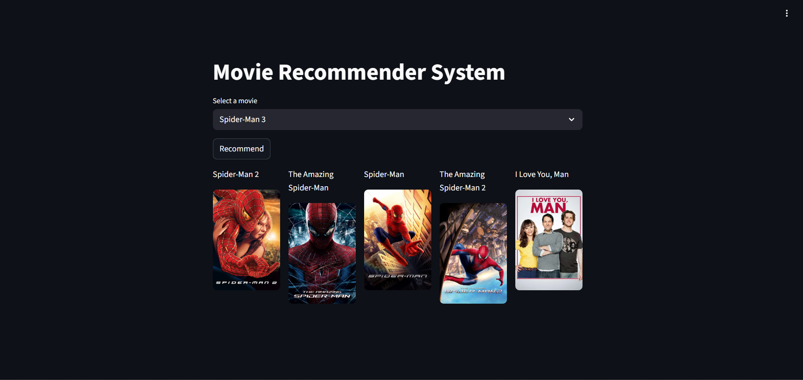

Markdown
# Movie Recommender System 🎬
A Content-Based Movie Recommender System that suggests similar movies based on the user's preference.

## 🚀 Features
* Recommends top 5 similar movies.
* Fetches movie posters using TMDB API.
* Interactive web interface built with Streamlit.

## 🛠️ Tech Stack
* **Language:** Python
* **Libraries:** Pandas, Scikit-learn, Streamlit, Requests, Pickle
* **Deployment:** Streamlit Cloud / Heroku

## 📋 How to Run Locally
1. Clone the repository:
   ```bash
   git clone [https://github.com/YOUR_USERNAME/YOUR_REPO_NAME.git](https://github.com/YOUR_USERNAME/YOUR_REPO_NAME.git)

# Install dependencies:

* Bash
* pip install -r requirements.txt
* Run the app:

# Bash
* streamlit run app.py

📸 Demo
[]


---